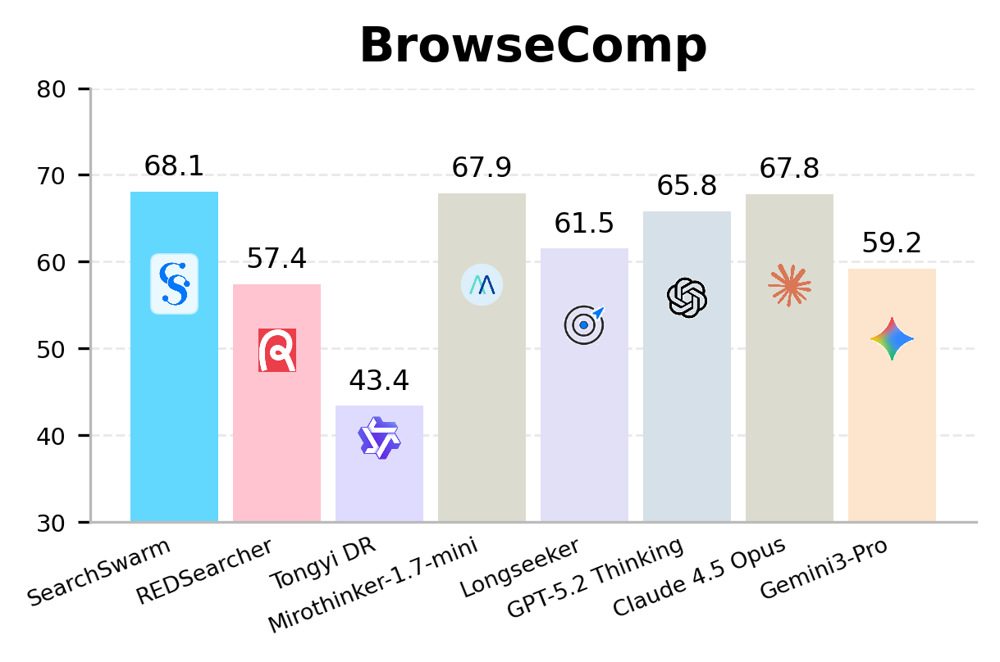
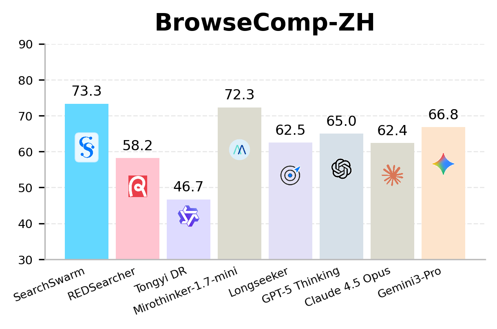
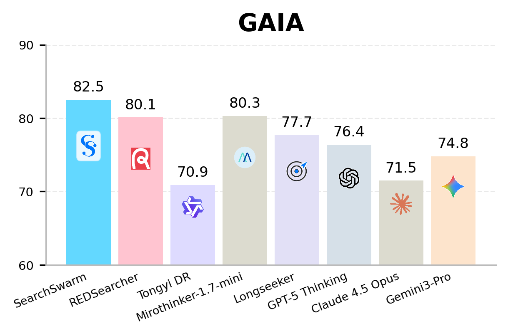
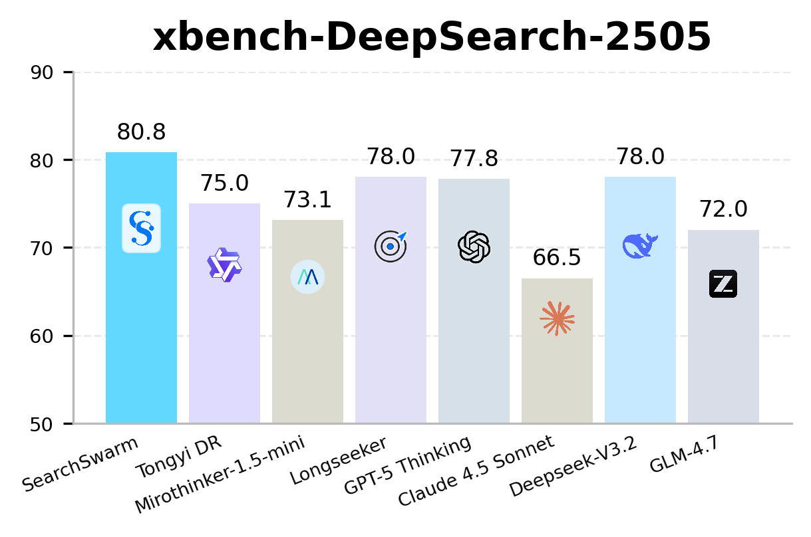

<p align="center">
  
</p>

# SearchSwarm: Delegation Intelligence for Long-Horizon Deep Research

This is the official code repository for **SearchSwarm: Towards Delegation Intelligence in Agentic LLMs for Long-Horizon Deep Research**.

SearchSwarm trains a main research agent to use subagents as an active context-management mechanism. The main agent decomposes long-horizon research tasks, dispatches bounded evidence-gathering subtasks, receives compact citation-grounded reports, and synthesizes the final answer under a finite context budget.

<p align="center">
  <a href="https://Search-Swarm.github.io">📃 Project Page</a>
  &nbsp; | &nbsp;
  <a href="https://huggingface.co/SearchSwarm/SearchSwarm-30B-A3B">🤗 Model Weights</a>
  &nbsp; | &nbsp;
  <a href="https://huggingface.co/datasets/SearchSwarm/SearchSwarm-SFT">🤗 SFT Dataset</a>
  &nbsp; | &nbsp;
  <a href="https://arxiv.org/abs/2606.09730v1">📑 Paper</a>
</p>


## Overview

SearchSwarm focuses on **delegation intelligence** in agentic LLMs:

- **Subagents as context management**: subagents work in independent contexts and return compact, evidence-grounded reports to the main agent.
- **Harness-guided trajectory synthesis**: the harness encourages decomposition, comprehensive subagent briefing, verification, and citation-grounded reporting.
- **High-quality SFT data for delegation**: cleaned trajectories teach when to delegate, how to brief, and how to verify returned findings.
- **Strong lightweight performance**: SearchSwarm-30B-A3B achieves state-of-the-art results among comparable 30B-A3B open-source lightweight research agents.

## Performance

<p align="center">
  
  
</p>

<p align="center">
  
  
</p>

See the paper for the complete comparison tables and evaluation details.

## Quickstart: Harness Evaluation

The harness reads configuration from `harness/.env`. Start from the example file:

```bash
cd harness
pip install -r requirements.txt
cp .env.example .env
# Edit .env with your model path, dataset path, and API keys.
```

The repository ships only a tiny synthetic example dataset under `harness/eval_data/example/` to demonstrate the expected schema. Real benchmark data is not redistributed; obtain benchmark files from their official sources, convert them to the supported JSONL schema, and point `DATASET` to your local file:

```json
{"task_question": "<question>", "ground_truth": "<answer>", "file_name": "", "metadata": {}}
```

### API-mode inference

Use this mode when the main model and subagent model are served by an OpenAI-compatible endpoint.

```bash
cd harness
cp .env.example .env
# Set MODEL_MODE=api, API_BASE_URL, API_KEY, MODEL_PATH, DATASET, OUTPUT_PATH.
bash run_react_infer.sh
```

### Local vLLM inference

Use this mode when running the model locally on eight vLLM servers.

```bash
cd harness
cp .env.example .env
# Set MODEL_MODE=local and MODEL_PATH.
bash deploy_model.sh
bash run_react_infer.sh
```

`deploy_model.sh` starts one vLLM server per GPU on ports `6001-6008`. If both the main agent and subagents use API mode, you can skip deployment.

For full harness configuration, including `ENABLE_SUB_AGENT`, `SEARCH_MODE`, `TOOL_TYPE`, subagent budgets, and LLM-as-judge settings, see [`harness/README.md`](harness/README.md).

## Training

The training scripts run full-parameter SFT with ms-swift's Megatron backend.

### SFT data

[SearchSwarm-SFT](https://huggingface.co/datasets/SearchSwarm/SearchSwarm-SFT) stores one bundle per row: a main-agent conversation plus the sub-agent conversations it dispatched (`messages` + `subagents` columns). `train/convert_share_to_cached.py` streams the parquet and unrolls it into flat ms-swift `messages` records — one per main and per sub-agent trajectory:

```bash
cd train
hf download SearchSwarm/SearchSwarm-SFT --repo-type dataset --local-dir SearchSwarm-SFT
python convert_share_to_cached.py --parquet SearchSwarm-SFT/train.parquet --out data.jsonl
```

The parquet must be read streaming — `pandas.read_parquet` / `pyarrow.parquet.read_table` fail on its single 2.1 GB row group. See [`train/README.md`](train/README.md) for details and the pre-tokenization step.

### Single-GPU smoke test

This validates the environment and launch chain with a small model and the bundled debug data. It is not a production SearchSwarm training run.

```bash
cd train
bash setup_env.sh
bash train_megatron.sh
```

### Multi-node SFT

Production-scale 30B-A3B training is designed for a multi-node GPU cluster. The repository provides three launch paths:

- `train_megatron_ray.sh`: Ray-based dispatch for cloud clusters without inter-node SSH.
- `train_megatron_multinode.sh`: SSH / torchrun path for traditional clusters.
- `train_megatron_shared_fs.sh`: shared-filesystem rendezvous path for schedulers such as Kubernetes jobs or cloud batch.

See [`train/README.md`](train/README.md) for the full setup, dataset preparation and pre-tokenization, parallelism defaults, and launcher-specific instructions.

## Notes on Evaluation Data

The repository intentionally does **not** bundle full benchmark test sets such as BrowseComp, BrowseComp-ZH, GAIA, or xbench-DeepSearch. Please obtain these datasets from their official sources and follow their redistribution / no-train policies.

## Citation

```bibtex
@misc{searchswarm2026,
  title        = {SearchSwarm: Towards Delegation Intelligence in Agentic LLMs for Long-Horizon Deep Research},
  author       = {Ning, Pu and Chen, Quan and Tao, Kun and Tang, Xinyu and Wang, Tianshu and Cao, Qianggang and Kong, Xinyu and Wen, Zujie and Zhang, Zhiqiang and Zhou, Jun},
  year         = {2026},
  note         = {Under review}
}
```

## Acknowledgements

This repository builds on open-source infrastructure from the agent and LLM training ecosystem, including vLLM, ms-swift, Megatron-LM, Qwen-Agent, Serper, and Jina.
